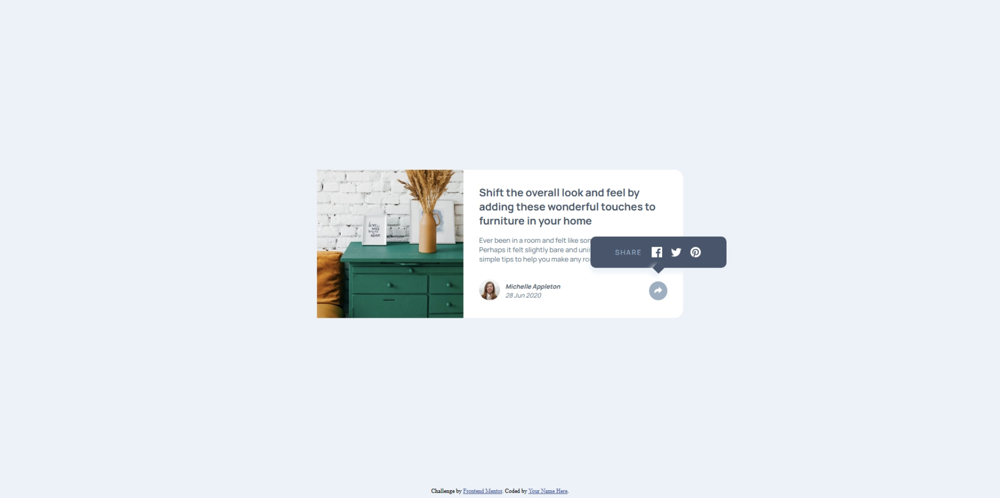

# Frontend Mentor - Article preview component solution

This is a solution to the [Article preview component challenge on Frontend Mentor](https://www.frontendmentor.io/challenges/article-preview-component-dYBN_pYFT). Frontend Mentor challenges help you improve your coding skills by building realistic projects. 

## Table of contents

- [Overview](#overview)
  - [The challenge](#the-challenge)
  - [Screenshot](#screenshot)
  - [Links](#links)
- [My process](#my-process)
  - [Built with](#built-with)
  - [What I learned](#what-i-learned)
- [Author](#author)

## Overview

I recently built a webpage as part of a challenge by Frontend Mentor, and I’m pretty excited about how it turned out! The design is clean and modern, blending a decorative image with a neatly structured text section.

### The challenge

Users should be able to:

- View the optimal layout for the component depending on their device's screen size
- See the social media share links when they click the share icon

### Screenshot

### Links

- Solution URL: [View Source Code](https://github.com/FA23BCS233/article-preview-card.git)
- Live Site URL: [Visit Live Site](htpps://fa23bcs233.github.io/article-preview-card.git)

## My process

### Built with

- Semantic HTML5 markup
- CSS custom properties
- Flexbox
- CSS Grid
- Mobile-first workflow

### What I learned

This Frontend Mentor challenge was a great hands-on learning experience. I improved my CSS layout skills, especially using flexbox and positioning for responsive design. Experimenting with  helped me refine pseudo-element styling, including absolute positioning and transformations. I also learned how pointer-events affect user interactions, ensuring hidden elements don’t interfere. Additionally, working with responsive techniques made me more aware of scalable units and media queries. Most importantly, I realized that building projects is the best way to solidify concepts, making learning more practical and rewarding. 🚀
Let me know if you'd like any tweaks!

## Author

- Website - [Muhammad Arham](#)
- Frontend Mentor - [@FA23Bcs233](https://www.frontendmentor.io/profile/fa23bcs233)
